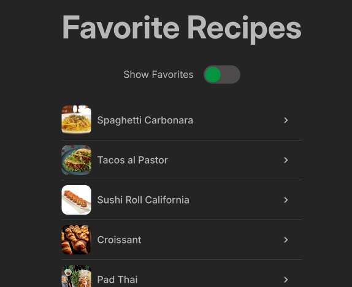
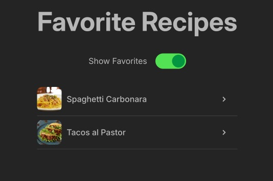
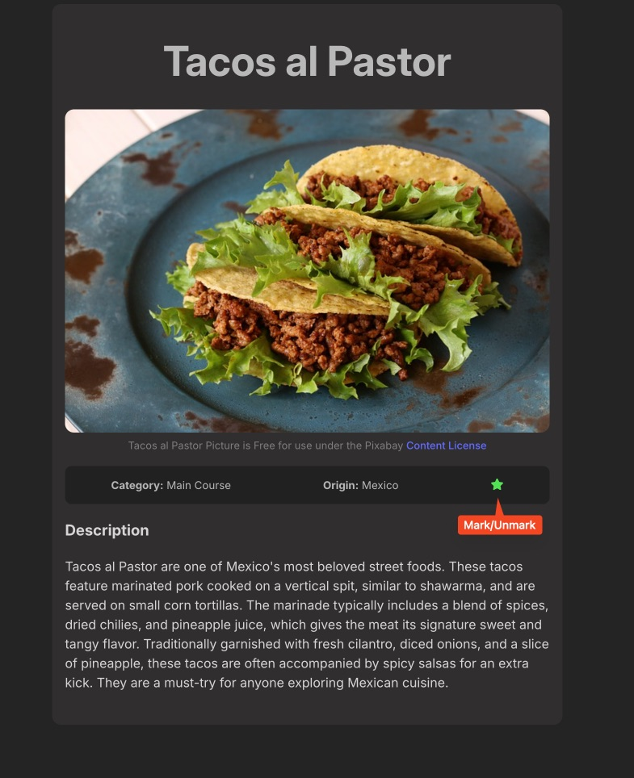

# Favorite Recipes React and CSS Project

This project is a web application for managing favorite recipes. It allows users to mark recipes as favorites, filter favorite recipes, and handle data loading errors.

## Project Goals

My goals with this project are to improve my skills in:

- **Responsive Design using only CSS**: Ensure that the application looks good on different screen sizes without using additional CSS frameworks.
- **Implement a Toggle to Filter and Display Favorite Items**: Allow users to toggle between viewing all recipes and only the recipes marked as favorites.
- **Implement the Functionality to Mark Each Recipe as Favorite**: Allow users to mark and unmark recipes as favorites.
- **Handle Errors in React when the Database Fails to Connect**: Implement error handling to display error messages when data loading fails.
- **Understand that `isLoading` is Important not Only as Visual Feedback but also to Manage the Loading of Elements at App Startup and Prevent Registering an Empty Array from the Database**: Use `isLoading` to manage the loading state and avoid displaying incorrect data.

### Use of `HashRouter`

In this project, `HashRouter` is used instead of `BrowserRouter` to handle routing. `HashRouter` is useful in applications deployed on static hosting services like GitHub Pages, as it uses the hash (`#`) in the URL to maintain the application's state on the client side without requiring additional server configuration.

## Technologies and Dependencies Used

- **React**: JavaScript library for building user interfaces.
- **React Router**: Library for handling navigation in the application.
- **React Icons**: Icon library for React.
- **Vite**: Fast build tool for frontend projects.
- **CSS**: Used for styling and appearance of the application.

## Screenshots

### Main View

### Favorites View

### Details View

## Author and License
This project was created by me and is licensed under the MIT License. See the LICENSE file for more details. All recipe pictures are free for use under the Pixabay [Content License](https://pixabay.com/service/license-summary/).